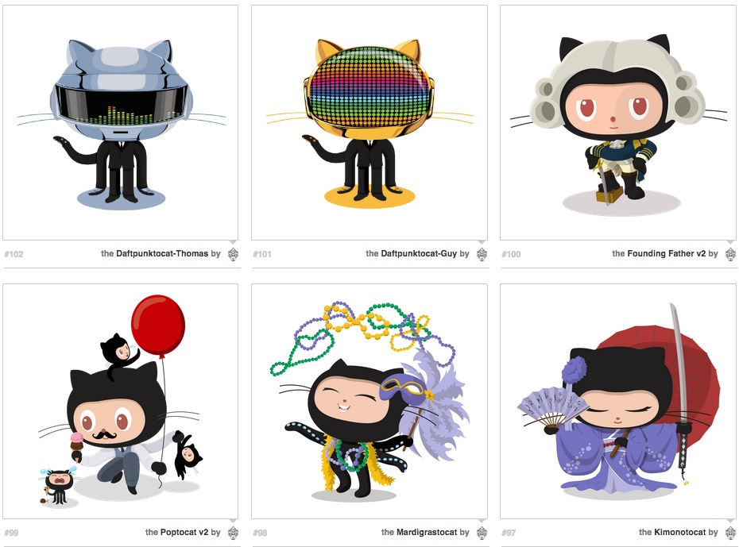

## git-intro
[curriculum] files and resources for Metrics and Data Visualization I - SVA-DSI

### description

In this class, we will walk through the fundamentals of collaborative coding with Github. We'll take you through various components code projects in a "version controled" system, or a system where you have some really cool ways to store versions and developments on your original code base. If you want to learn how to communicate better with your technical team, and share visualization projects in the open, this course is for you.

### credits

This class comes from materials cribbed and culled from various [Girl Develop It](https://www.girldevelopit.com/) curricula. Check out our [Materials Page](https://www.girldevelopit.com/materials) to learn more!

[@auremoser](twitter.com/auremoser)

[aurelia@mozillafoundation.org](mailto:aurelia@mozillafoundation.org)